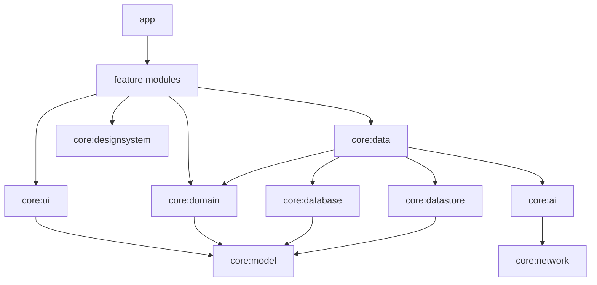

# 架构说明

## 原则

- **离线优先**：Room 是词库和复习状态的唯一事实来源；Compose 观察 `Flow`。
- **依赖单向**：feature 依赖 domain/model/UI；基础设施实现依赖 domain 契约，domain 不依赖 Android。
- **AI 可替换**：上层只认识 `LlmClient` 和 `AiVocabularyRepository`，OpenAI 协议细节限制在 `core:ai`。
- **UI 可演进**：主题、排版、颜色和间距在 `core:designsystem`；公共页面结构在 `core:ui`。第三方 UI 库优先在这两个模块适配。
- **错误显式化**：跨层失败使用 `AppResult` 和 `AppError`，避免网络异常直接穿透到 ViewModel。

## 模块依赖



`core:model`、`core:common` 和 `core:domain` 是 JVM 模块。业务规则可在没有 Android SDK、Room 或网络的环境中测试。

## 状态与事件

每个功能使用单向数据流：

```text
Compose event -> ViewModel -> UseCase -> Repository -> data source
Compose UI <- StateFlow <- ViewModel <- Room Flow / AppResult
```

ViewModel 负责屏幕状态和任务生命周期，不直接构造 HTTP 请求、读写数据库或管理加密密钥。

## 图片导入

```text
Photo Picker / Camera
  -> content Uri
  -> ImageDecoder 降采样到最长边 1600px
  -> JPEG 82%
  -> base64 data URL
  -> OpenAI-compatible chat/completions
  -> structured-output fallback
  -> WordExtractionParser
  -> 可编辑候选列表
  -> ImportWordsUseCase 去重
  -> 单个 Room transaction
  -> words/senses/examples/tags/FTS/deck/review_state
```

当前识图在前台协程中执行，适合单张图片。数据库已经包含 `import_batches` 和 `import_items` 暂存表；以后支持多页批量导入时，应由 WorkManager 写入这些表，UI 只观察批次状态，不通过 WorkManager `Data` 传递完整词条。

## AI 协议边界

`LlmClient` 提供一次性 completion 和流式 token 两种接口。`OpenAiCompatibleClient` 负责：

- Bearer Authorization（空密钥时不发送）
- text 与 multimodal message 编码
- response format 编码
- SSE `data:` 帧解析
- HTTP 状态到领域错误的映射
- 429/5xx 和超时的有限指数退避

供应商差异由 `VisionWordExtractor` 的格式降级处理。不要在 feature 中拼 prompt 或解析供应商 JSON。

## 密钥与 HTTP

API Key 的明文只存在于运行时内存。持久化流程：

```text
API Key -> AES/GCM/NoPadding -> DataStore ciphertext
               ^
        AndroidKeyStore SecretKey
```

HTTP 只用于不带密钥的本地模型服务。`SaveAiSettingsUseCase` 与 `TestAiConnectionUseCase` 共用相同验证规则，防止测试按钮绕过安全检查。

## 数据模型

- `words`：规范化 headword 唯一索引
- `word_senses` / `word_examples`：释义和例句一对多关系
- `word_tags`：标准关系表，不使用 CSV 字段
- `decks` / `deck_words`：词书多对多关系及顺序
- `review_states`：当前调度状态
- `review_logs`：不可变复习事件，统计页的数据源
- `words_fts`：headword、释义、翻译搜索
- `import_batches` / `import_items`：后台批量任务扩展点
- `ai_cache`：可选的结果缓存扩展点

## SRS

`SrsScheduler` 隔离调度算法。初始实现 `Sm2Scheduler` 采用 Again/Hard/Good/Easy 四档输入，并确保 ease factor 不低于 1.3。

引入 FSRS 时应新增 `FsrsScheduler`，通过 Hilt binding 切换，不修改页面或 Repository。需要新增 stability、difficulty 等字段时，必须先设计 Room migration。

## 构建约定

`build-logic` 统一：

- compileSdk 37 / minSdk 29 / Java 11 bytecode
- AGP 9 built-in Kotlin；不得应用 `org.jetbrains.kotlin.android`
- Compose BOM 和 tooling
- Hilt + KSP
- Room compiler 和 schema 导出

新增 feature 通常只需：

```kotlin
plugins {
    id("onmyenglish.android.feature")
}
```

不要使用 kapt。新增注解处理器时优先确认 KSP 2 与 AGP 9 built-in Kotlin 兼容性。
